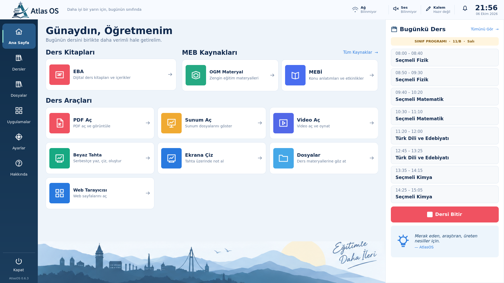
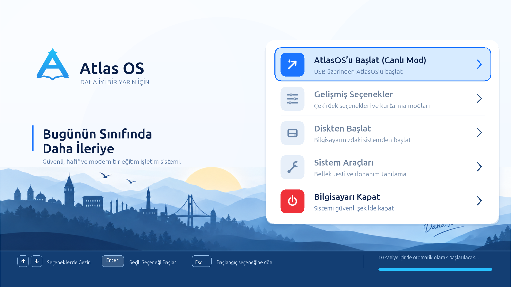
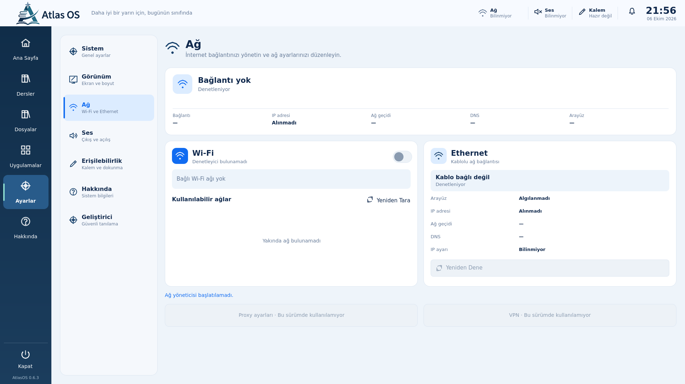
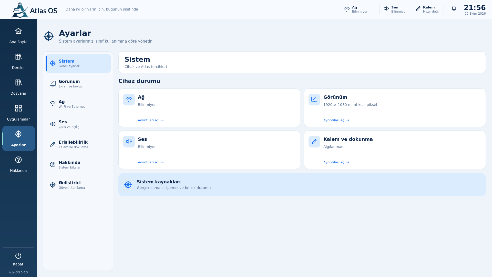
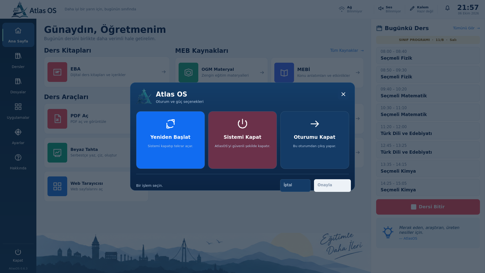

# AtlasOS

**A classroom-focused Linux Live system for interactive boards.** AtlasOS puts lesson tools, device controls, and diagnostics in a dedicated Qt/QML desktop, with a custom UEFI boot frontend.

*Atlas desktop rendered from the current QML interface. The capture uses local test/service state; it is not a hardware compatibility claim.*

**Current status:** 0.6.3 Development Preview. One OVMF/QEMU run reached the Live desktop; the project owner reports one successful UEFI Live test on a Casper Excalibur G870. Physical evidence is limited to that device. **There is no public ISO download.** The public source repository is available at [github.com/chavooosss/AtlasOS](https://github.com/chavooosss/AtlasOS), and the [product website](https://chavooosss.github.io/AtlasOS/) introduces the project.

## AtlasOS at a glance

AtlasOS explores a classroom-centered workflow: open common teaching tools, reach local educational-resource shortcuts, and check network, sound, display, and device status from one interface. It is based on Ubuntu Live and integrates existing Linux components rather than replacing their system services.

The project is intended for teachers using classroom interactive boards, with school technical staff as a secondary audience. Broad hardware compatibility and measured classroom usability have not been established.

## Product tour

The screenshots below are genuine renders of the current AtlasOS implementation. QML screens were rendered with the project’s offscreen PySide6 smoke renderer; the Boot Manager image is an existing project capture. They are not generated mockups or full-OS VM captures. See [capture provenance and limitations](docs/media/README.md).

  
  

  
  

  

Atlas resource tiles may show names such as EBA, OGM Material, and MEBİ as textual shortcuts. They do not represent official integration, endorsement, or a service backend.

## What is included

- **Atlas desktop:** a Qt 6 / PySide6 QML shell with home, navigation, settings, lesson tools, and application shortcuts.
- **System controls:** Atlas interfaces for audio, network status, power, removable media, and dock/window tracking, built on existing Linux services.
- **Classroom tools:** local resource shortcuts, document and presentation launchers, video, whiteboard, and screen annotation.
- **Diagnostics:** a Developer Center and bounded system/boot information collection with documented storage-safety limits.
- **UEFI startup:** a Rust Atlas Boot Manager followed by a GRUB backend on the documented successful path.

These descriptions summarize implemented interfaces; they do not imply that every device, peripheral, or external service has been validated.

## Evidence and limitations

| Area | Current evidence |
|---|---|
| UEFI Live startup | One OVMF/QEMU run reached the Live desktop; one physical result is owner-reported for a Casper Excalibur G870 |
| Classroom interactive boards | Designed with this use in mind; no broad model matrix has been tested |
| Legacy BIOS | Best-effort only; unsupported/unvalidated for new builds and not release-gating |
| Secure Boot | Not validated |
| Network, audio, display, and touch | Implemented interfaces; behavior depends on device and available system services |
| Installer and managed provisioning | Not implemented |
| Official MEB/EBA/OGM/MEBİ integration | Not established; visible entries are local shortcuts/references |
| Public binary | No ISO download is published; the 0.6.3 RC remains under package-notice and source-obligation review |

See [project status](docs/project/status.md), [validation records](docs/testing/README.md), and the [release status](docs/release/README.md) for evidence boundaries.

## Build and contribute

The source repository is public under the project’s [contribution guidance](CONTRIBUTING.md). AtlasOS-owned code is covered by the root MIT license; third-party components retain their own terms. Generated ISOs, VM disks, and build outputs do not belong in Git history.

Builds use Linux/WSL tooling and network package sources. Read the [build guide](docs/build/README.md) before building; a clean-clone reproducible end-to-end build is not yet claimed. The [CI workflow](docs/development/ci.md) runs source and policy checks, not a full ISO build or hardware test.

## Learn more

- [Architecture](docs/architecture/overview.md) · [Source map](docs/architecture/source-map.md)
- [Project status](docs/project/status.md) · [Documentation index](docs/README.md)
- [Build guide](docs/build/README.md) · [Testing guide](docs/testing/README.md) · [CI](docs/development/ci.md)
- [Roadmap](ROADMAP.md) · [Changelog](CHANGELOG.md) · [Security policy](SECURITY.md)
- [Release and download status](docs/release/README.md) · [Asset and license scope](docs/legal/project-license-scope.md)

AtlasOS development predates its public Git baseline. The initial commit is a curated source snapshot, not reconstructed history. See the [publication record](docs/project/publication-record.md).

## Türkçe kısa özet

AtlasOS, sınıf içi etkileşimli tahta kullanımına odaklanan Ubuntu tabanlı bir Live Linux ortamıdır. Qt/QML masaüstü, ders araçları, sistem kontrolleri, tanılama arayüzü ve özel UEFI açılış arayüzü içerir. Proje 0.6.3 Geliştirme Önizlemesi aşamasındadır; geniş donanım uyumluluğu doğrulanmamıştır ve henüz herkese açık ISO indirmesi bulunmamaktadır.
